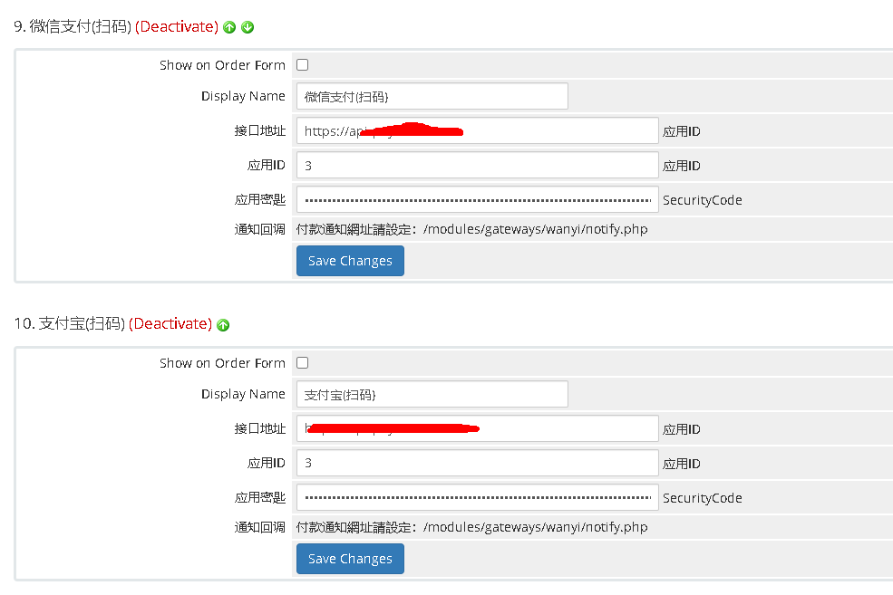

# WHMCS vPay 免签支付模块 , whmcs-payment-mianqian

抱歉，这个版本算残废了，依赖的开源项目残了		
测试了一个新的，完整的方案暂时无问题

查看新的这个吧
 - [https://github.com/hostsoft/whmcs_payment_vmq](https://github.com/hostsoft/whmcs_payment_vmq)

			

				

								2023/05/06 发布

			

					

这就是个WHMCS的插件,实现订单支付完成后自动入账更新账单为已支付的功能       
本来打算把监控客户端重写下,加个强制模式，测试过了还能用就不折腾了

### 更新记录
解决类重复加载问题

>>> 如果有WHMCS定制类的产品可以联系哦       
>>> 微信: base64_decode(aG9zdHNvZnQ=)         

> **注意**
> 1. 本项目为开源项目，本人不可能总会及时修复存在的漏洞
> 2. 请仔细阅读README和开发文档,非代码本身问题不予以处理
> 3. 有能力者可自行对漏洞进行修复并pull给我，我会及时审查
> 4. 感谢您的理解与使用，如果对您有帮助，请点个star，感谢您的支持！

### 目录结构

    _APK 下面是监控APP，安装在安卓手机上的
    _Backed  https://github.com/dreamncn/VPay 的镜像压缩包
    WHMCS_Plugin WHMCS插件

### 运行原理

用户点击订单 -> 选择扫码支付 -> 进入面前支付页     

用户扫码付款 -> 收到款项后手机通知栏会有提醒 -> V免签监控端监听到提醒，推送至服务端->服务端根据金额判断是哪笔订单

### 安装步骤

#### 第一步

安装 这个后端     
        https://github.com/dreamncn/VPay        
安装教程见这个project的readme.md
完成后建个应用,获得ID和密匙

#### 第二步

安装 监控APP        
        https://github.com/szvone/VmqApk
扫描配置好，针对各种手机的配置     
见 project 的readme.md        
就是那些关闭省电什么的     
        
#### 第三步

全部配置完成      
    上传WHMCS的支付模块，后台激活       

### 相关资源

原作者的PHP版VPay：[这里](https://github.com/szvone/vmqphp)

原作者的JAVA版的开源地址位于：[这里](https://github.com/szvone/Vmq)

原作者的监控端的开源地址位于：[这里](https://github.com/szvone/VmqApk)

